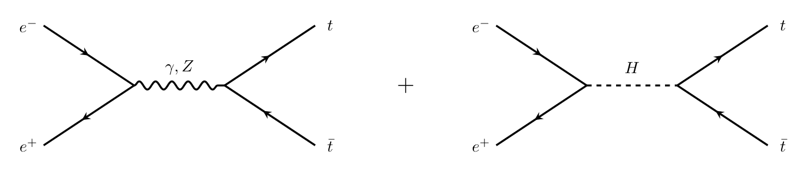
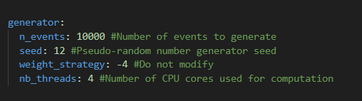

# Development of a Monte Carlo Event Generator for Top-Quark Physics at the FCC-ee  

TIPP Project – GOGEL Yann - SAUER Julien - MARGUIN Jérémy - Master 2 SAP – 2026  

This project consists of the development of a Monte Carlo event generator for top–antitop production in electron–positron collisions at the FCC-ee threshold energy, $\sqrt{s}$ = 365 GeV. The objective is to provide a transparent and modular implementation of the process  
e⁺e⁻ → t t̄  

<p align="center">
  
</p>

including QED and full electroweak (GSW) contributions with an explicit helicity treatment.

The generator computes the differential cross section, performs the numerical integration of the total cross section, and produces events in the Les Houches Event (LHE) format. The results can then be analyzed and statistically compared to MadGraph simulations.

Events are generated in a specific "Les Houches Events" (LHE) structure and then exported as:

- ```.txt``` files readable by our Analyzer

- standard ```.lhe``` files usable by external software (MadAnalysis, Pythia, etc.)

## Prerequisites
- C++ compiler (g++)
- make
- libyaml-cpp (sudo apt install libyaml-cpp-dev) : Parser .yaml
- ROOT

## Repository Structure
```
.
├── LHE/                      # Generator and LHE file writing
│   ├── source/               # source code
│   ├── include/              # headers
│   ├── bin/                  # executable (Generator)
│   ├── configuration/        # .yaml configuration files
│   └── Makefile
│
├── Processor/                # Event analysis
│   ├── source/               # source code + ROOT macro
│   ├── include/              # headers
│   ├── bin/                  # executables (Analyzer + Comparator)
│   └── Makefile
│
├── Results/                  # Generated events and analysis outputs (plots) – outputs from Generator and Analyzer
├── Results_compare/          # Comparisons with MadGraph (plots + statistical processing) – output from Comparator
└── README.md
```

## Compilation

Compilation is done in two steps. From the `Projet_TIPP/LHE` directory, run:

```bash
make clean
make
```
The executable is generated in : ```./LHE/bin```

- Eco+

Then move to `Projet_TIPP/Processor` and run:

```bash
make clean
make
```
The executables are generated in : ```./Processor/bin```

- Analyzer
- Comparator

All executables must be launched from the root directory `Projet_TIPP/`. Running them from another location may lead to incorrect file paths.

---

## Running the Event Generator

To generate events, execute:

```bash
./LHE/bin/Eco+
```

You will first be asked to provide a <RUN_NAME> for the run (for example `MY_FIRST_RUN`).  
Then you must select a configuration file in YAML format. By default, the program loads a file named `Config`. Pressing Enter without typing anything will automatically use this default configuration.

After execution, a new directory is created in `Results/` with the name of your run. Inside this directory, you will find:

- `<RUN_NAME>_LHE.txt`
- `<RUN_NAME>_LHE.lhe`

These files contain the generated events in LHE format.

---

## Analyzing the Generated Events

Once the LHE file has been produced, you can analyze it using:

```bash
./Processor/bin/Analyzer
```

The program will ask for the name of the directory to analyze. Provide the name of your run (for example `MY_FIRST_RUN`).  

The analyzer reads the corresponding `_LHE.txt` file and produces all relevant plots in:

```
Results/MY_FIRST_RUN/MY_FIRST_RUN_output/
```


## Comparison with MadGraph

To compare your results with a MadGraph simulation, you must first convert the MadGraph `event.lhe` file into a `_LHE.txt` file and place it respecting the name convention:

```
.
├── Results/
│   ├── <MADGRAPH_RUN_NAME>/
│   │   └── <MADGRAPH_RUN_NAME>_LHE.txt
```

It is essential that the file name strictly follows the pattern:

```
directory_name_LHE.txt
```

For example:

```
Results/MG_RUN/MG_RUN_LHE.txt
```

Once this is done, run:

```bash
./Processor/bin/Comparator
```

You will be prompted to provide:
- the name of the MadGraph directory (e.g. `MG_RUN`)
- the name of your Eco+ directory (e.g. `MY_FIRST_RUN`)

The program will then generate comparison plots in:

```
Result_compare/MG_RUN_MY_FIRST_RUN/
```

This directory contains the histograms as well as a text file summarizing statistical quantities such as total cross sections, forward–backward asymmetries, and p-values.

---

## Physics Content

The implemented process is tree-level top–antitop production in electron–positron collisions. The generator includes photon, Z boson, and Higgs exchange diagrams as well as their interference terms. Helicity amplitudes are explicitly evaluated and sampled during event generation.

The total cross section can be computed both through deterministic numerical integration and through Monte Carlo estimation, allowing a direct comparison with MadGraph and a quantitative validation of the implementation.

## File Format

The .txt files contain events in a structure compatible with the LHE format (presence of specific tags such as ```</event>, </header>```, etc., similar to XML).

```
<LesHouchesEvents version="3.0">
<header>
<configPhysics>
# Chosen model : Z-boson exchange
# Collision energy : 365.000000
############### MASSES and WIDTHS ##############
Electron mass     : 0.000511 GeV
Top quark mass    : 172.500000 GeV
Z-boson mass      : 91.187600 GeV
Higgs boson mass  : 125.100000 GeV
W-boson mass      : 80.369200 GeV
Z-boson width     : 2.495200 GeV
Higgs boson width : 0.004070 GeV
################################################
# Renormalisation scale : 365.000000
# sin^2(theta_W) : 0.223203
# QED coupling constant : 0.007812
# Strong coupling constant : 0.118000 
# Number of color : 3.000000
</configPhysics>
<configGenerator>
# Number of generated events : 100000.000000
# Seed                       : 12.000000
# Weight strategy            : -4.000000
# Number of Threads          : 4.000000
</configGenerator>
</header>
<init>
-11 11 1.825000e+02 1.825000e+02 0 0 247000 247000 -4 1
3.760242e-02 4.592235e-11 3.760242e-02 1
<generator name='Madgraph_Eco+' version=1.0> </generator>
</init>
<event>
4 1 1.000000e+00 3.650000e+02 1.180000e-01 7.812500e-03
11 -1    0    0    0    0 0.000000e+00 0.000000e+00 1.825000e+02 1.825000e+02 5.110000e-04 0.000000e+00 1
-11 -1    0    0    0    0 -0.000000e+00 -0.000000e+00 -1.825000e+02 1.825000e+02 5.110000e-04 0.000000e+00 -1
6 1    1    2    501    0 4.110790e+01 -4.194962e+01 -1.001850e+01 1.825000e+02 1.725000e+02 0.000000e+00 -1
-6 1    1    2    0    501 -4.110790e+01 4.194962e+01 1.001850e+01 1.825000e+02 1.725000e+02 0.000000e+00 -1
</event>
```

See https://arxiv.org/abs/hep-ph/0609017 for a detailled description of the structure.
J. Alwall et al., “A standard format for Les Houches Event Files”, arXiv:hep-ph/0609017 (2006), published in Computer Physics Communications 176 (2007) 300-304

## Reproducibility of the results

Since our Monte Carlo code relies on a pseudo-random number generator, it is possible to reproduce identical results on any computer by specifying the same seed in the configuration file.

Because our code is parallelized using OpenMP to improve .lhe file writing performance, it is important to use the same number of threads (modifiable in the configuration file) in order to obtain identical results.

Indeed, each thread is associated with a unique seed derived from the seed specified in the configuration file.
One can check the configuration used for a specific run directly in the ```./Results/<run_name>/<run_name>_LHE.txt``` file.
<p align="center">
  
</p>

